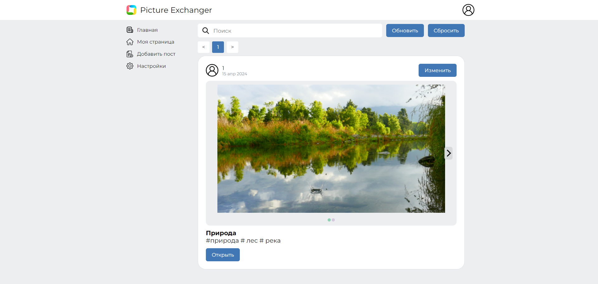
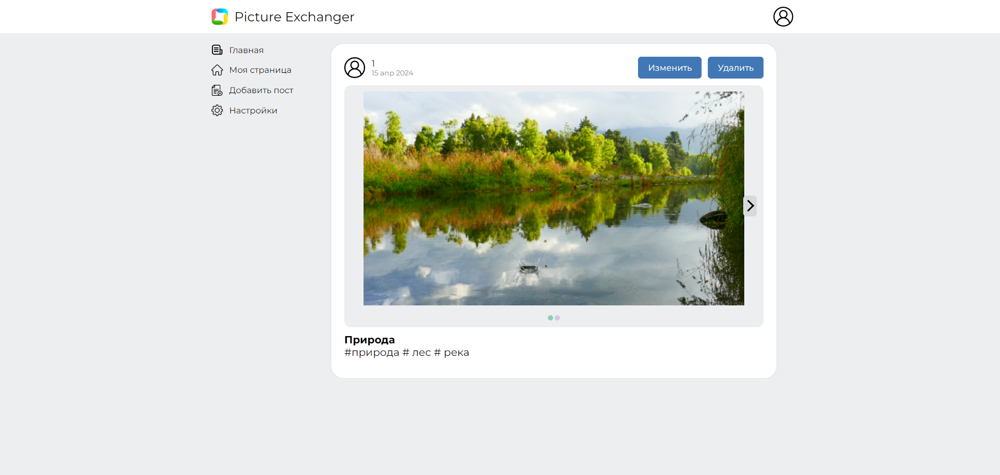
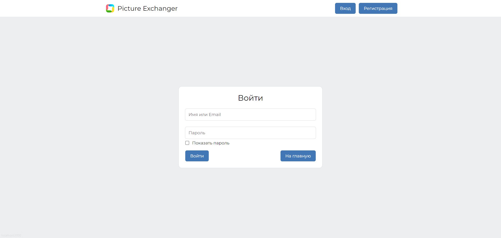
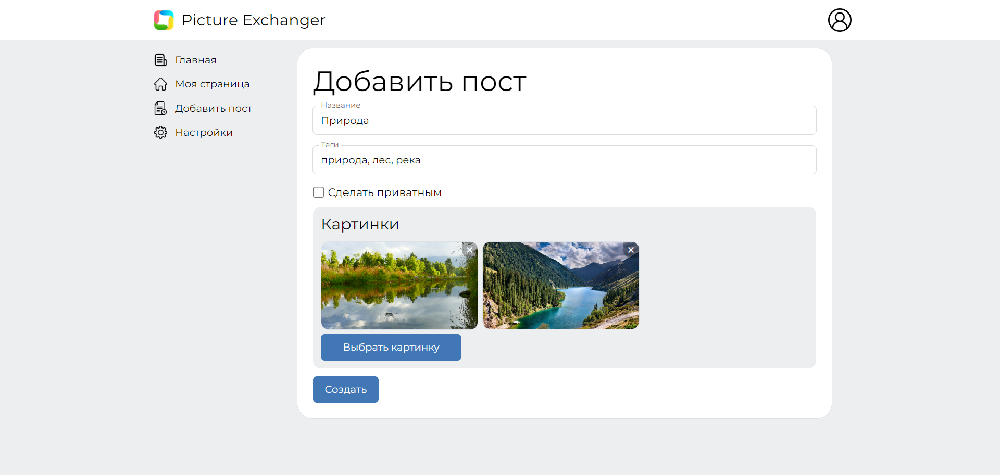
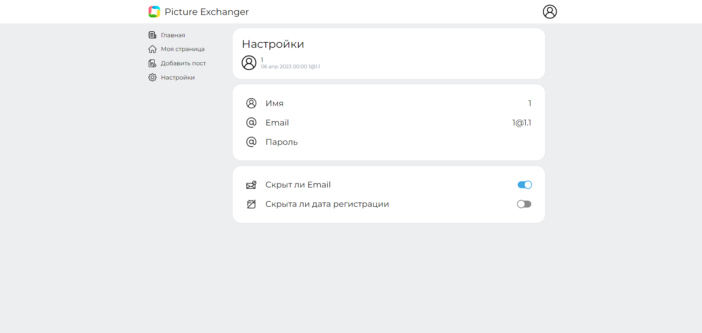
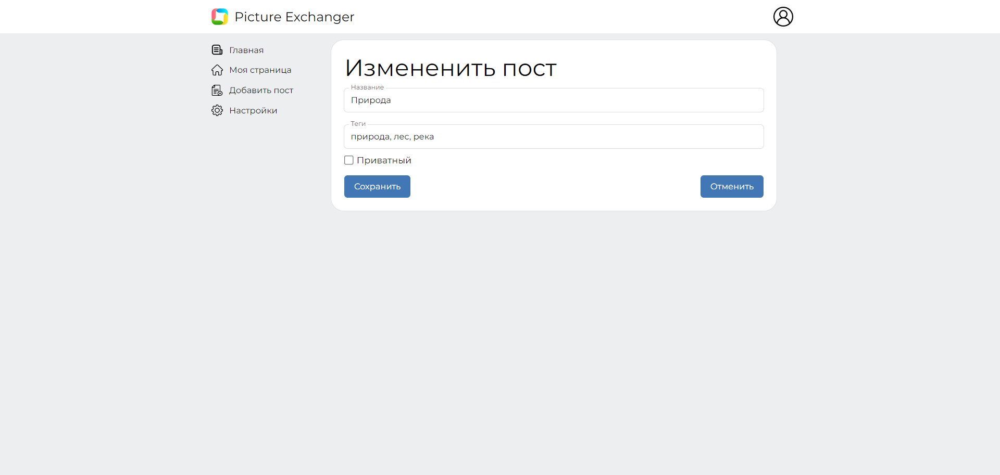
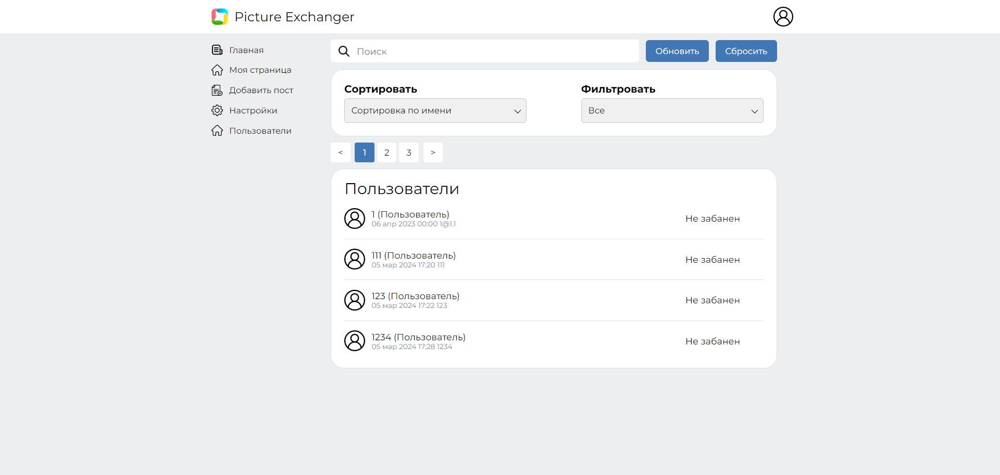

# Обменщик картинками

## О проекте

Сайт, на котором можно создавать посты с картинками. У поста есть картинки, название и список тегов.

На сайте есть незарегистрированные пользователи, которые могут просматривать профили пользователей и ленту с постами. Также есть обычные пользователи, которые могут создавать свои посты. Есть менеджеры, которые могут банить посты пользователей. Есть суперменеджеры, которые выдают роль менеджера обычным пользователям. Есть администраторы, которые назначают супер менеджеров и могут банить аккаунты пользователей. Есть суперадминистраторы, которые назначаются администраторов.

При входе на главную страницу сайта будет показана лента с постами.

На каждый пост можно перейти. 

Для добавления, изменения и удаления постов необходимо зарегистрироваться или войти в акканут.

При нажатии на кнопку "Добавить пост" откроется страница для добавления поста.

При нажатии на кнопку "Настройки" откроется страница с настройками аккаунта пользователя.

Перейдя к посту можно его изменить.

Администраторы могут зайти на страницу со списком пользователей

